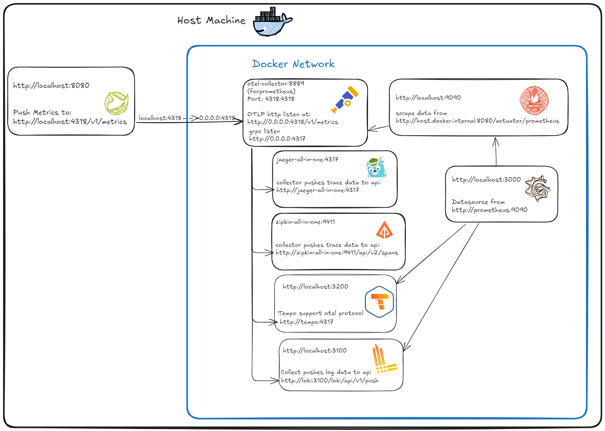
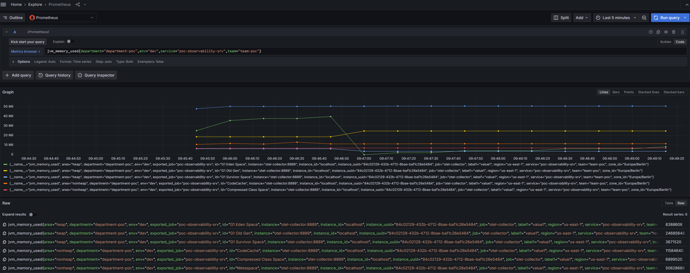

# springboot3 observability



## Run
- docker compose up
- mvn spring-boot:run

## Link
- http://localhost:8080/actuator
- http://localhost:16686/
- http://localhost:9411/zipkin/
- http://localhost:9090/
- http://localhost:3000/
- http://localhost:3200/
- http://localhost:3100/
- http://localhost:8080/actuator/metrics/
- http://localhost:8080/actuator/metrics/jvm.memory.used
- http://localhost:8080/actuator/metrics/jvm.memory.used?tag=area:heap
- http://localhost:8080/actuator/metrics/do.sleep.method.timed
- http://localhost:8080/actuator/metrics/http.server.requests?tag=uri:/sleep

## Ref
- https://grafana.com/docs/tempo/latest/getting-started/
- https://docs.spring.io/spring-boot/reference/actuator/metrics.html#actuator.metrics.customizing
- https://docs.spring.io/spring-boot/reference/actuator/metrics.html#actuator.metrics.customizing.per-meter-properties
- 
## OpenTelemetry Configuration in Application properties
```
otel.sdk.disabled=false

otel.propagators=tracecontext,b3
otel.exporter.otlp.protocol=grpc
otel.exporter.otlp.enabled=true
otel.exporter.otlp.endpoint=http://localhost:4317
# always_on, always_off
otel.traces.sampler=parentbased_always_on
# otel.traces.sampler=traceidratio
# otel.traces.sampler.arg=1.0
# otel.exporter.otlp.certificate=
# otel.exporter.otlp.client.certificate=
# otel.exporter.otlp.headers=
otel.exporter.otlp.timeout=10000
otel.experimental.exporter.otlp.retry.enabled=false

# otel.{signal}.exporter=logging-otlp
# otel.{signal}.exporter=otlp
# otel.exporter.otlp.{signal}.enabled=true
# otel.exporter.otlp.{signal}.endpoint=http://localhost:4317
# otel.exporter.otlp.{signal}.certificate
# otel.exporter.otlp.{signal}.client.certificate
# otel.exporter.otlp.{signal}.headers

# Specify logical service name. Takes precedence over service.name defined with otel.resource.attributes.
# If unspecified, the SDK sets service.name=unknown_service:java by default.
otel.service.name=poc-service
otel.resource.attributes.deployment.environment=dev
otel.resource.attributes.service.name=poc-service
otel.resource.attributes.service.namespace=myspace

# Batch Span Processor
otel.bsp.schedule.delay=5000
otel.bsp.max.queue.size=2048
otel.bsp.max.export.batch.size=512
otel.bsp.export.timeout=30000

# Batch log record processor
otel.blrp.schedule.delay=1000
otel.blrp.max.queue.size=2048
otel.blrp.max.export.batch.size=512
otel.blrp.export.timeout=30000

# Prometheus exporter
# otel.metrics.exporter=prometheus
# otel.exporter.prometheus.port=9464
# otel.exporter.prometheus.host=0.0.0.0
```

## Screenshot
