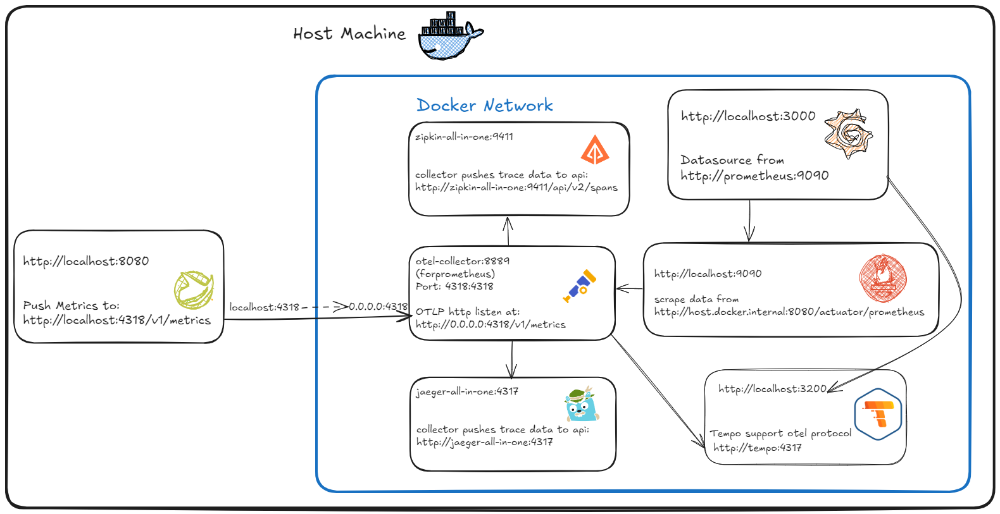

# springboot3 observability

## Run
- docker compose up
- mvn spring-boot:run

## Link
- http://localhost:8080/actuator
- http://localhost:16686/
- http://localhost:9411/zipkin/
- http://localhost:9090/
- http://localhost:3000/
- http://localhost:3200/

## Ref
- https://grafana.com/docs/tempo/latest/getting-started/
